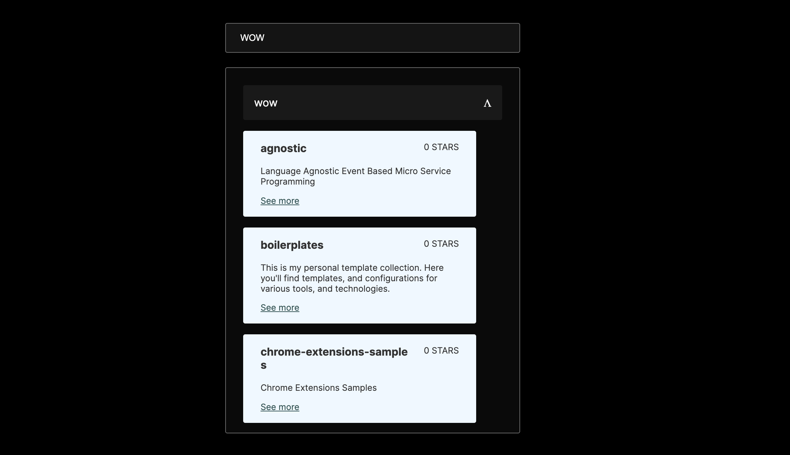

TLDR:
```npm i && npm run dev```

<p align="center">
  
</p>

Locally it will work without a github token but the rates are pretty limited.

I've focused on simplicity and semantics.

Potential improvements
- Refactor routing logic so shared code is in a util.
- debounce user input
- Use a library for routing.
- Style solution could be nicer to work with.
- make it pop 💥
- add unit testing.
- api error handling.

